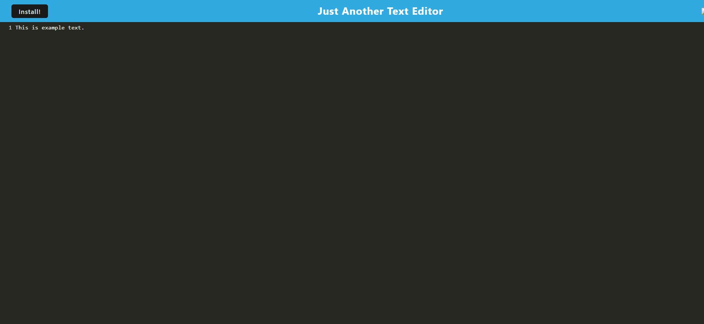

## <h1>Ians-PWA-Challenge</h1>
<h2> Table of Contents </h2> 

- [Website](#website)
- [Description](#description)
- [Installation](#installation)
- [Usage](#usage)
- [Technologies Used](#technologiesused)
- [Contributers](#contributers)
- [Email](#email)
- [Screenshots](#screenshots)

<h2>Website</h2>

[Link](https://ians-pwa-challenge.herokuapp.com/)
<h2>Description</h2>
This application is a text editor that can be used for anything from a shopping list to a notes app.

<h2>Installation</h2>
Just use the Heroku link ande you'll be taken to the site. Feel free to clone the repository and run it locally as well if you'd like.

<h2>Usage</h2>
This is a text editor that saves data to the local storage for offline use.

<h2>Technologies Used</h2>

- Javascript
- Express
- Workbox
- Babel
- WebpackPwaManifest

<h2>Contributers with GitHub Links</h2>
Myself ( https://github.com/ianbridges ) and Bobby Bridges ( https://github.com/Zaphod1977 ) we're study parterns and co-contributed to the project.

<h2>Email</h2>
ianexample@email.com

<h2>Screenshots</h2>

